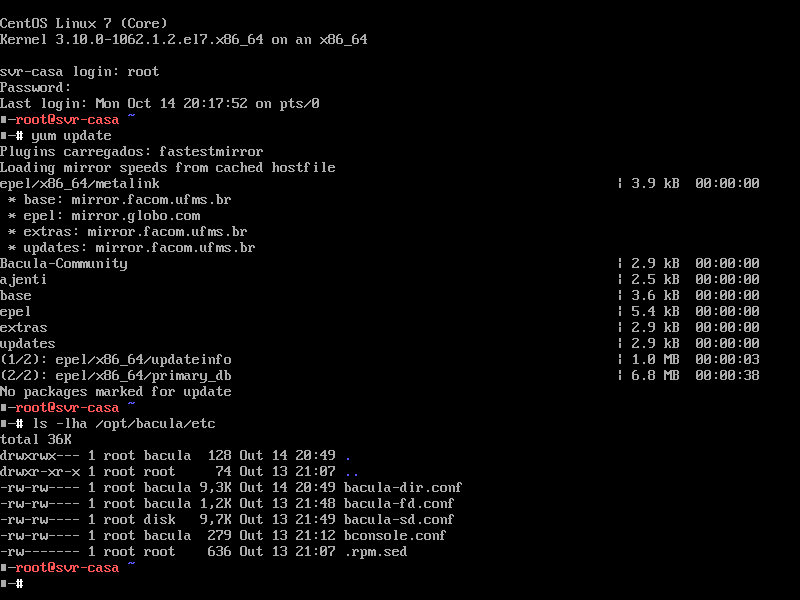

# Meu Primeiro Video
## O que é Linux?

Neste video gostaria de mostra o Linux, da forma como eu uso, e mostra que não é esse *bicho de sete cabeças* que alguns pensam, que Linux esta muito mais perto de você do que imagina.

Exemplos
- **Android**
- **Roteador**
- **YouTube**

1. Explodindo sua mente

Primeiramente Linux não é só isso:

Linux pode ser isso:

> Quem é da area de tecnologia, deveria **conhecer**, **experimentar** um pouco de cada sistema,
> eu gostaria de experimentar um Mac, para tirar as minha proprias conclusões, e não ficar só com a
> opnião dos outros.
> Não posso falar de Mac porque nunca usei mais posso falar de Linux, sistema que usar desde 2012 e
> posso falar tambem do Windows, pois foi aonde comecei e acompanho 

2. Aonde estão?
3. 
